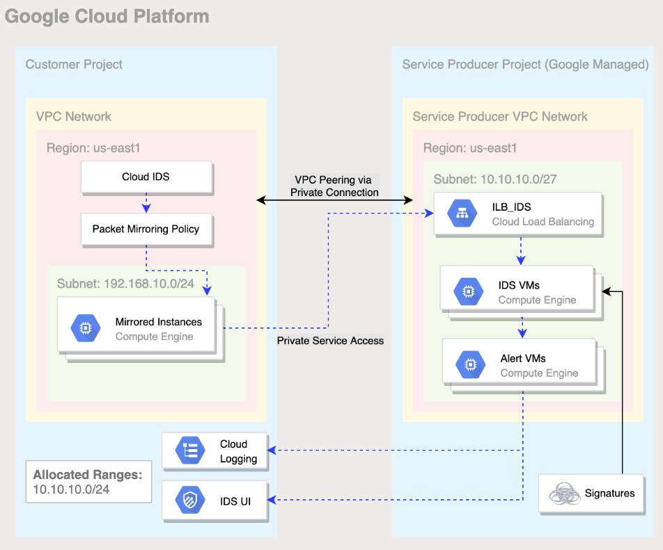

# Demo Guide
This demo uses terraform to setup Cloud IDS in a project and two compute instance to simulate network threats detected by Cloud IDS using Google Cloud Services like [Cloud IDS](https://cloud.google.com/ids), [Cloud Compute Engine](https://cloud.google.com/compute) and [Cloud Logging](https://cloud.google.com/logging).


## Demo Architecture Diagram
The image below describes the architecture of Cloud IDS demo.




## What resources are created?
Main resources:
- Cloud IDS endpoint
- Two Compute Instance
  1. `victim-machine` - Act as a victim server machine
  1. `attacker-machine` - Act as a malicious attcker machine, targeting the victim machine
  1. `network-components` - VPC network, subnet, private vpc connect, cloud NAT and cloud router


## How to deploy?
The following steps should be executed in Cloud Shell in the Google Cloud Console.

### 1. Create a project and enable billing
Follow the steps in [this guide](https://cloud.google.com/resource-manager/docs/creating-managing-projects).


### 2. Deploy the infrastructure using Terraform

This terraform deployment requires the following variables.

- demo_project_id       = "YOUR_PROJECT_ID"
- vpc_network_name      = "cloud-ids-vpc"
- network_region        = "us-east1"
- network_zone          = "us-east1-b"

From the root folder of this repo, run the following commands:

```
export TF_VAR_demo_project_id=[YOUR_PROJECT_ID]
terraform init
terraform apply
```

**Note:** VPC network name, Region and Zone are give a default value. If you wish to deploy the resources in a different region or change VPC name, update the corresponding variables in variable.tf file.

### 3. Take note of Terraform Outputs

Once terraform finishes provisioning all resources, you will see its outputs. Please take note of outputs, it can be used to simulate manual attacks.
Navigate to `Cloud Console >> Network Security >> Cloud IDS >> Dashboard` to check the simulated attacks performed by attacker machine over victim machine and detected by Cloud IDS.


## How to clean-up?

From the root folder of this repo, run the following command:
```
terraform destroy
```

<!-- BEGINNING OF PRE-COMMIT-TERRAFORM DOCS HOOK -->
## Inputs

| Name | Description | Type | Default | Required |
|------|-------------|------|---------|:--------:|
| network\_region | Network region for IDS | `string` | `"us-east1"` | no |
| network\_zone | Network zone for IDS | `string` | `"us-east1-b"` | no |
| project\_id | Project ID to deploy resources | `string` | `"test2-testuser"` | no |
| vpc\_network\_name | VPC network name for IDS | `string` | `"cloud-ids-vpc"` | no |

## Outputs

| Name | Description |
|------|-------------|
| ids\_endpoint\_id | IDS Endpoint id |
| ids\_endpoint\_severity | IDS Endpoint severity |
| ids\_malicious\_attacker\_server | n/a |
| ids\_victim\_server\_ip | n/a |

<!-- END OF PRE-COMMIT-TERRAFORM DOCS HOOK -->